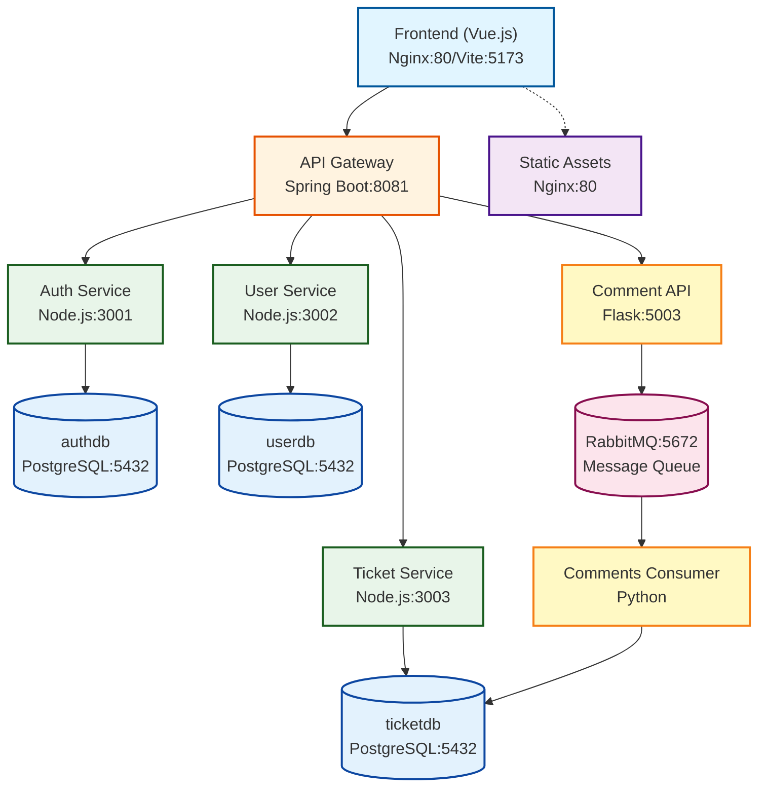

# Fix This Stuff - Ticket Management System

A comprehensive microservices-based platform for managing technical support tickets, developer resources, and collaborative problem-solving.

## Table of Contents

- [Overview](#overview)
- [Architecture](#architecture)
- [Services](#services)
- [Authentication & Security](#authentication--security)
- [Getting Started](#getting-started)
- [API Documentation](#api-documentation)
- [Development Guide](#development-guide)
- [Troubleshooting](#troubleshooting)
- [Project Status](#project-status)

## Overview

Fix This Stuff is a modern ticket management system built with a microservices architecture, featuring:

- JWT-based authentication with role-based access control
- Real-time comment system using RabbitMQ event streaming
- RESTful API Gateway for centralized routing and security
- Containerized deployment with Docker Compose
- Vue.js frontend with responsive UI

## Architecture

### System Components



### Microservices Architecture

The application follows a microservices pattern with service isolation:

- **Separate databases** per service (authdb, userdb, ticketdb)
- **API Gateway** for request routing and JWT authentication
- **Service-to-service communication** via REST APIs
- **Event-driven comments** using RabbitMQ message broker
- **Resolution workflow** with peer review and point system
- **Public leaderboard** ranking users by points earned

### Technology Stack

#### Backend
- **API Gateway**: Spring Boot (Java), port 8081
- **Auth Service**: Node.js/Express, port 3001
- **User Service**: Node.js/Express, port 3002
- **Ticket Service**: Node.js/Express, port 3003
- **Comment API**: Python/Flask, port 5003
- **Comments Consumer**: Python (RabbitMQ consumer)

#### Infrastructure
- **Database**: PostgreSQL (separate databases per service)
- **Message Broker**: RabbitMQ
- **Reverse Proxy**: Nginx (for frontend)
- **Container Orchestration**: Docker Compose

#### Frontend
- **Framework**: Vue.js 3 with Composition API
- **State Management**: Pinia
- **Routing**: Vue Router
- **HTTP Client**: Axios
- **UI Framework**: Bootstrap 5
- **Build Tool**: Vite

## Services

### Auth Service (Port 3001)

Handles authentication and credential management.

**Responsibilities:**
- User registration and login
- JWT token generation and verification
- Credential storage and validation
- Password hashing with bcrypt

**Database**: `authdb`
- Table: `credentials` (id, username, password, created_at)

**API Endpoints:**
- `POST /api/auth/register` - Register new user
- `POST /api/auth/login` - Authenticate user
- `GET /api/auth/verify-token` - Verify JWT token validity
- `POST /api/auth/verify-token` - Verify token via POST body
- `GET /api/auth/health` - Health check

### User Service (Port 3002)

Manages user profiles, roles, and permissions.

**Responsibilities:**
- User profile CRUD operations
- Role management (developer, moderator, admin)
- User skills tracking
- Authorization checks

**Database**: `userdb`
- Table: `users` (id, email, name, surname, role, rank, credentials_id)
  - Note: `rank` field stores the total points/score earned by the user
- Table: `user_skills` (user_id, skill)

**API Endpoints:**
- `GET /api/users` - List all users (admin only)
- `GET /api/users/:userId` - Get user details
- `PUT /api/users/:userId` - Update user profile
- `DELETE /api/users/:userId` - Delete user (admin only)
- `GET /api/roles` - List available roles
- `PUT /api/users/:userId/role` - Update user role (admin only)
- `GET /api/users/leaderboard` - Get public leaderboard (no authentication required)
- `PATCH /api/users/internal/:userId/rank` - Update user rank (internal)
- `PATCH /api/users/internal/:userId/score` - Update user score (internal)

### Ticket Service (Port 3003)

Manages support tickets and topics.

**Responsibilities:**
- Ticket CRUD operations
- Priority and status management
- Ticket assignment to developers
- Topic categorization

**Database**: `ticketdb`
- Table: `ticket` (id, title, priority, status, request, answer, etc.)
- Table: `topic` (id, name)
- Table: `ticket_topic` (ticket_id, topic_id)
- Table: `comment` (id, comment_text, author_id, ticket_id, creation_date)
- Table: `developer_points` (developer_id, total_points, tickets_resolved, average_rating)
- Table: `ticket_rating` (ticket_id, rating, comment, rated_by, rated_at)

**API Endpoints:**
- `GET /api/tickets` - List all tickets
- `POST /api/tickets` - Create new ticket
- `GET /api/tickets/:ticketId` - Get ticket details
- `PUT /api/tickets/:ticketId` - Update ticket
- `DELETE /api/tickets/:ticketId` - Delete ticket
- `POST /api/tickets/:ticketId/request-resolution` - Request resolution approval
- `POST /api/tickets/:ticketId/approve-resolution` - Approve resolution (moderators/admins)
- `POST /api/tickets/:ticketId/reject-resolution` - Reject resolution (moderators/admins)
- `GET /api/tickets/admin/pending-approval` - Get tickets pending approval
- `POST /api/tickets/:ticketId/rating` - Rate a resolved ticket
- `GET /api/tickets/:ticketId/rating` - Get ticket rating

### Comment API (Port 5003)

Flask-based API for managing ticket comments with event-driven architecture.

**Responsibilities:**
- Comment CRUD operations
- Publishing comment events to RabbitMQ
- JWT token validation
- Direct database reads for performance

**API Endpoints:**
- `GET /tickets/:ticketId/comments` - List comments for a ticket
- `POST /comments` - Create new comment (publishes event)
- `PUT /comments/:commentId` - Update comment (publishes event)
- `DELETE /comments/:commentId` - Delete comment (publishes event)
- `GET /health` - Health check

### Comments Service (Consumer)

Python service that consumes RabbitMQ events for asynchronous comment persistence.

**Responsibilities:**
- Listen to comment events (created, updated, deleted)
- Persist changes to PostgreSQL
- Ensure eventual consistency

**Events Handled:**
- `comment.created` - Insert new comment
- `comment.updated` - Update comment text
- `comment.deleted` - Remove comment

### API Gateway (Port 8081)

Spring Boot gateway for routing, authentication, and CORS.

**Responsibilities:**
- Route requests to appropriate microservices
- JWT token validation via AuthFilter
- CORS configuration for frontend
- Request/response logging
- Header management for internal communication

**Routing:**
- `/api/auth/**` → Auth Service (no authentication required)
- `/api/users/**` → User Service
- `/api/tickets/**` → Ticket Service
- `/api/comments/**` → Comment API
- `/api/roles/**` → User Service

### Frontend UI (Port 80/5173)

Vue.js single-page application with responsive design.

**Features:**
- User authentication (login/register)
- Ticket browsing and creation
- Ticket resolution workflow with peer review
- User management (admin)
- Role assignment
- Points-based leaderboard
- Pending approvals queue for moderators
- Responsive Bootstrap UI

**Routes:**
- `/` - Home page
- `/login` - User login
- `/register` - User registration
- `/tickets` - Ticket list
- `/tickets/:id` - Ticket details
- `/leaderboard` - Public leaderboard
- `/pending-approvals` - Pending resolution approvals (moderators/admins)
- `/profile` - User profile
- `/admin` - Admin panel (admins/moderators)

## Resolution Workflow & Leaderboard

### Ticket Resolution Process

The system implements a peer-review resolution workflow to ensure quality and prevent self-approval:

1. **Assignment**: Any authenticated user can self-assign to an open ticket
2. **Implementation**: User works on the resolution
3. **Request Approval**: User submits resolution via `POST /api/tickets/:id/request-resolution`
   - Ticket `solve_status` changes to `pending_approval`
   - Records `resolved_by` (user ID) and `resolved_at` (timestamp)
4. **Peer Review**: Another moderator or administrator reviews the resolution
5. **Decision**:
   - **Approved**: Points automatically awarded based on priority and rating
   - **Rejected**: User can resubmit after modifications

### Anti-Self-Approval Rule

A critical constraint ensures fairness:
- Users cannot approve tickets they resolved themselves
- The `resolved_by` user ID must differ from `approved_by` user ID
- Requires peer review for all resolutions

### Point System

**Base Points by Priority:**
- High priority: 10 points
- Medium priority: 5 points
- Low priority: 2 points

**Rating Bonus:**
When the ticket requester rates the resolution (1-5 stars):
- Bonus = rating × 2
- Total Points = Base Points + Rating Bonus

**Example:**
- Medium priority ticket (5 points) + 5-star rating (10 bonus) = 15 total points

### Leaderboard

The public leaderboard ranks all users by total points earned:
- Accessible at `/leaderboard` (no authentication required)
- Displays rank, name, total points, tickets resolved, and average rating
- Updated automatically when resolutions are approved
- Endpoint: `GET /api/users/leaderboard`

## Authentication & Security

### JWT Token Flow

The system implements a secure JWT-based authentication mechanism:

1. **User Login**: Client sends credentials to `/api/auth/login`
2. **Token Generation**: Auth service validates credentials and generates JWT
3. **Token Storage**: Frontend stores token in localStorage
4. **Authenticated Requests**: Client includes token in Authorization header
5. **Gateway Validation**: API Gateway validates JWT using AuthFilter
6. **Header Injection**: Gateway adds trusted headers (x-user, x-role) for microservices
7. **Service Authorization**: Microservices check headers for authorization

### Security Architecture

```
Frontend                API Gateway              Microservices
   │                         │                         │
   │  Authorization:         │                         │
   │  Bearer <token>         │                         │
   ├────────────────────────>│                         │
   │                         │ 1. Validate JWT         │
   │                         │ 2. Extract user/role    │
   │                         │                         │
   │                         │  x-user: 123            │
   │                         │  x-role: admin          │
   │                         │  X-Internal-Auth: true  │
   │                         ├────────────────────────>│
   │                         │                         │
   │<────────────────────────┼─────────────────────────│
```

### Security Measures

**Frontend to Gateway:**
- HTTPS recommended for production
- Bearer token authentication only
- No internal headers exposed to client

**Gateway to Microservices:**
- Trusted header injection (x-user, x-role, x-username)
- X-Internal-Auth flag for service-to-service verification
- Original Authorization header removed

**Database:**
- Passwords hashed with bcrypt (10 rounds)
- Separate databases per service
- No cross-service foreign keys

**CORS Configuration:**
- Allowed origins: localhost:5173, localhost:80, localhost:8080, localhost
- Allowed methods: GET, POST, PUT, DELETE, PATCH, OPTIONS
- Credentials enabled
- Internal headers not exposed to frontend
- OPTIONS preflight requests handled at gateway level

## Getting Started

### Prerequisites

- Docker 20.10 or higher
- Docker Compose 2.0 or higher
- Node.js 20+ (for local frontend development)
- Maven 3.8+ (for gateway development)

### Quick Start

1. **Clone the repository:**
```bash
git clone https://github.com/antoninofoti/fix-this-stuff.git
cd fix-this-stuff
```

2. **Start all services:**
```bash
docker compose up --build
```

3. **Access the application:**
- Frontend: http://localhost (production) or http://localhost:5173 (development)
- API Gateway: http://localhost:8081
- RabbitMQ Management: http://localhost:15672 (guest/guest)
- pgAdmin: http://localhost:8080 (admin@example.com/admin)

### Default Admin Account

A default admin account is created automatically on first startup:

- **Email**: admin@fixthisstuff.com
- **Password**: admin123

To override defaults:
```bash
export ADMIN_EMAIL=your.admin@example.com
export ADMIN_PASSWORD=your_secure_password
docker compose up
```

**Security Warning**: Change the default password immediately in production environments.

## API Documentation

Complete API documentation is available in [documentation/API.md](documentation/API.md).

### Quick Reference

**Authentication:**
- `POST /api/auth/register` - Register new user
- `POST /api/auth/login` - User login
- `GET /api/auth/verify-token` - Verify JWT token

**Tickets:**
- `GET /api/tickets` - List all tickets
- `POST /api/tickets` - Create new ticket
- `GET /api/tickets/:id` - Get ticket details
- `PUT /api/tickets/:id` - Update ticket
- `DELETE /api/tickets/:id` - Delete ticket
- `POST /api/tickets/:id/request-resolution` - Request resolution approval
- `POST /api/tickets/:id/approve-resolution` - Approve resolution (moderators)
- `POST /api/tickets/:id/reject-resolution` - Reject resolution (moderators)
- `GET /api/tickets/admin/pending-approval` - Get pending approvals

**Users:**
- `GET /api/users` - List users (admin/moderator)
- `GET /api/users/:id` - Get user details
- `PUT /api/users/:id` - Update user profile
- `PUT /api/users/:id/role` - Update user role (admin)
- `GET /api/users/leaderboard` - Get public leaderboard

**Comments:**
- `GET /tickets/:ticketId/comments` - List comments
- `POST /comments` - Create comment
- `PUT /comments/:commentId` - Update comment
- `DELETE /comments/:commentId` - Delete comment

**Ratings:**
- `POST /api/tickets/:id/rating` - Rate a ticket
- `GET /api/tickets/:id/rating` - Get ticket rating

## Development Guide

### Running in Development Mode

```bash
# Start all services
docker compose up -d

# View logs for specific service
docker compose logs -f api-gateway
docker compose logs -f ui

# Restart a specific service after code changes
docker compose restart auth-service

# Rebuild a service after major changes
docker compose up -d --build auth-service

# Stop all services
docker compose down

# Stop and remove all volumes (clean slate)
docker compose down -v
```

### Local Frontend Development

For faster frontend iteration with hot-reload:

```bash
cd ui
npm install
npm run dev
```

Frontend will be available at http://localhost:5173 with hot-reload enabled.

**Note**: When developing locally, ensure your `.env.local` file points to the running API Gateway:
```
VITE_AUTH_API_URL=http://localhost:8081/api/auth
VITE_USER_API_URL=http://localhost:8081/api/users
VITE_TICKET_API_URL=http://localhost:8081/api/tickets
VITE_ROLE_API_URL=http://localhost:8081/api/roles
VITE_COMMENT_API_URL=http://localhost:5003/api/comments
```

### Database Access

**Using PgAdmin:**
1. Navigate to http://localhost:8080
2. Login with credentials (admin@example.com/admin)
3. Add server:
   - Host: `postgres-fts`
   - Port: `5432`
   - Username: `postgres`
   - Password: `postgres`

**Using psql:**
```bash
docker exec -it postgres-fts psql -U postgres -d [database-name]
```

### Testing

For detailed testing procedures, see [documentation/DEVELOPMENT.md](documentation/DEVELOPMENT.md).

**Quick API Test:**
```bash
# Register a user
curl -X POST http://localhost:8081/api/auth/register \
  -H "Content-Type: application/json" \
  -d '{"email":"test@example.com","password":"test123","firstName":"Test","lastName":"User"}'

# Login and get token
curl -X POST http://localhost:8081/api/auth/login \
  -H "Content-Type: application/json" \
  -d '{"email":"test@example.com","password":"test123"}'
```

## Troubleshooting

### Common Issues

#### Port Already in Use

**Solution**: 
```bash
# Check what's using a specific port
sudo lsof -i :8081

# Stop services and restart
docker compose down
docker compose up -d
```

#### CORS Errors in Browser

**Solution**: Verify CORS configuration in `src/main/java/com/example/config/CorsConfig.java` includes your origin.

#### Cannot Connect to Microservices

**Solution**: Ensure all services are on the same Docker network (`fts-network`) and service names match.

#### Database Connection Errors

**Solution**: 
```bash
# Check PostgreSQL is running
docker compose logs postgres

# Verify databases exist
docker exec -it postgres psql -U admin -l
```

### Viewing Logs

```bash
# Individual services
docker compose logs -f auth-service
docker compose logs -f api-gateway
docker compose logs -f ui

# All services
docker compose logs -f

# Last 100 lines
docker compose logs --tail=100 auth-service
```

For comprehensive troubleshooting, see [documentation/TROUBLESHOOTING.md](documentation/TROUBLESHOOTING.md).

## Documentation

Comprehensive documentation is available in the [`/documentation`](documentation/) directory:

- **[API.md](documentation/API.md)**: Complete API endpoint documentation
- **[ARCHITECTURE.md](documentation/ARCHITECTURE.md)**: System design and component interaction
- **[DEVELOPMENT.md](documentation/DEVELOPMENT.md)**: Setup and development workflows
- **[FRONTEND_GUIDE.md](documentation/FRONTEND_GUIDE.md)**: Vue.js components and state management
- **[SECURITY.md](documentation/SECURITY.md)**: Authentication and authorization details
- **[TROUBLESHOOTING.md](documentation/TROUBLESHOOTING.md)**: Common issues and solutions
- **[TICKET_RESOLUTION_WORKFLOW.md](documentation/TICKET_RESOLUTION_WORKFLOW.md)**: Resolution workflow specification
- **[IMPLEMENTATION_SUMMARY.md](documentation/IMPLEMENTATION_SUMMARY.md)**: Feature implementation overview

### Additional Resources

- **[UserStories.xlsx](documentation/UserStories.xlsx)**: User stories and requirements
- **[FunctionPointsAnalysis.xlsx](documentation/FunctionPointsAnalysis.xlsx)**: Function points analysis
- **[FixThisStuff_Mockups.pdf](documentation/FixThisStuff_Mockups.pdf)**: UI mockups and designs
- **[CocomoII.png](documentation/CocomoII.png)**: COCOMO II cost estimation
- **[DataMetrics.json](documentation/DataMetrics.json)**: Project metrics and statistics

## Project Status

### Completed Features

- Core microservices architecture (100%)
- JWT authentication and authorization (100%)
- User management with role-based access (100%)
- Ticket CRUD operations (100%)
- API Gateway with routing and security (100%)
- Backend comment system with RabbitMQ (100%)
- Frontend authentication and user management (100%)
- Frontend ticket management (100%)
- Ticket resolution workflow with peer review (100%)
- Points-based leaderboard system (100%)
- Pending approvals queue for moderators (100%)
- Ticket rating system (100%)
- Docker containerization (100%)

### Known Limitations

1. **Real-time Notifications**: Not implemented (could use WebSockets with RabbitMQ)
2. **File Attachments**: Not supported for tickets or comments
3. **Email Notifications**: Not implemented for ticket updates or approvals
4. **Audit Logging**: Limited logging of user actions
5. **Advanced Search**: Basic search functionality only

## License

This project is provided as-is for educational purposes.

## Acknowledgments

- Spring Boot team for the excellent framework
- Vue.js community for frontend tools
- PostgreSQL and RabbitMQ communities
