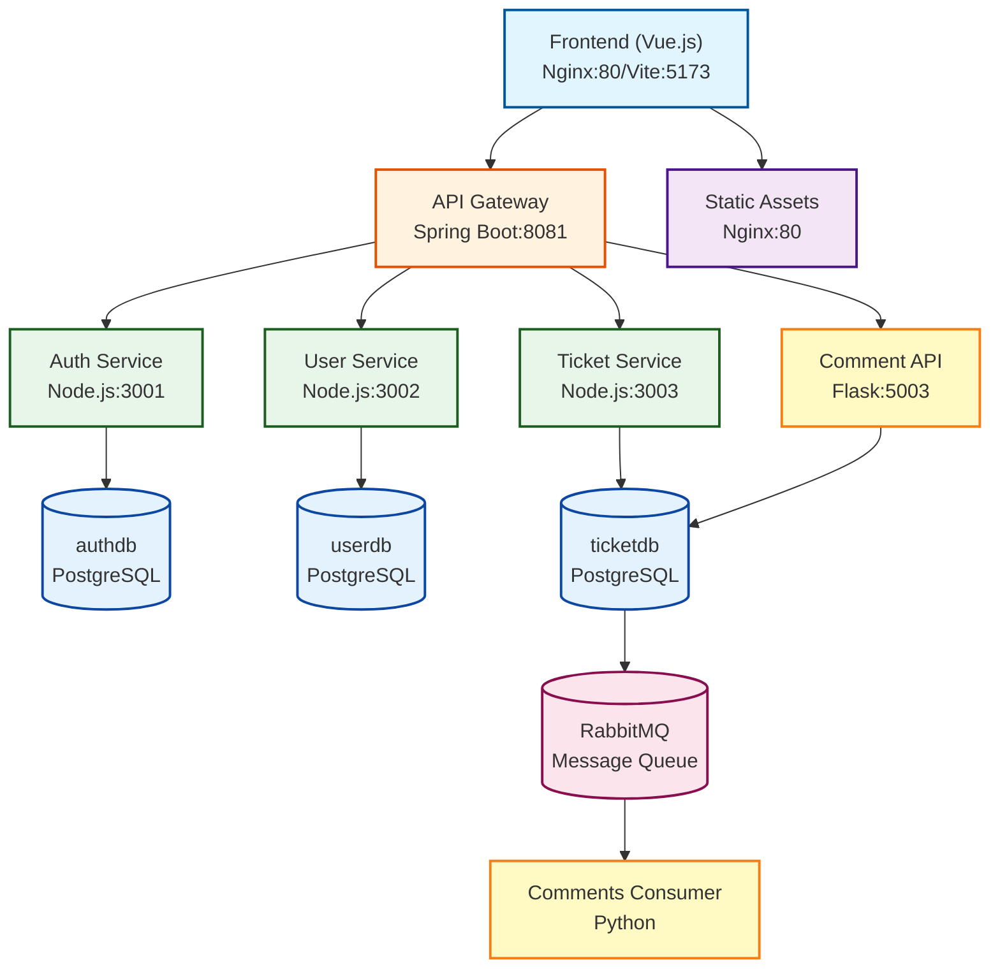

# Architecture Documentation

## System Components



## Microservices Architecture

The application follows a microservices pattern with service isolation:

- **Separate databases** per service (authdb, userdb, ticketdb)
- **API Gateway** for request routing and JWT authentication
- **Service-to-service communication** via REST APIs
- **Event-driven comments** using RabbitMQ message broker
- **Resolution workflow** with peer review and point system
- **Public leaderboard** ranking users by points earned

## Technology Stack

### Backend
- **API Gateway**: Spring Boot (Java), port 8081
- **Auth Service**: Node.js/Express, port 3001
- **User Service**: Node.js/Express, port 3002
- **Ticket Service**: Node.js/Express, port 3003
- **Comment API**: Python/Flask, port 5003
- **Comments Consumer**: Python (RabbitMQ consumer)

### Infrastructure
- **Database**: PostgreSQL (separate databases per service)
- **Message Broker**: RabbitMQ
- **Reverse Proxy**: Nginx (for frontend)
- **Container Orchestration**: Docker Compose

### Frontend
- **Framework**: Vue.js 3 with Composition API
- **State Management**: Pinia
- **Routing**: Vue Router
- **HTTP Client**: Axios
- **UI Framework**: Bootstrap 5
- **Build Tool**: Vite

## Services Overview

### Auth Service (Port 3001)

Handles authentication and credential management.

**Responsibilities:**
- User registration and login
- JWT token generation and verification
- Credential storage and validation
- Password hashing with bcrypt

**Database**: `authdb`
- Table: `credentials` (id, username, password, registration_date, role)

### User Service (Port 3002)

Manages user profiles, roles, and permissions.

**Responsibilities:**
- User profile CRUD operations
- Role management (developer, moderator, admin)
- User skills tracking
- Authorization checks
- Leaderboard management

**Database**: `userdb`
- Table: `users` (id, name, surname, email, rank, registration_date, credentials_id, role)
  - Note: `rank` field stores the total points/score earned by the user
- Table: `user_skills` (user_id, skill)

### Ticket Service (Port 3003)

Manages support tickets and topics.

**Responsibilities:**
- Ticket CRUD operations
- Priority and status management
- Ticket assignment to users
- Topic categorization
- Resolution workflow management
- Point calculation and awarding
- Ticket rating system

**Database**: `ticketdb`
- Table: `ticket` (id, title, priority, opening_date, deadline_date, flag_status, solve_status, request, answer, request_author_id, assigned_developer_id, system_id, resolved_by, resolved_at, approved_by, approval_date, rejection_reason)
- Table: `topic` (id, name)
- Table: `ticket_topic` (ticket_id, topic_id)
- Table: `comment` (id, comment_text, author_id, ticket_id, creation_date)
- Table: `developer_points` (id, developer_id, total_points, tickets_resolved, average_rating, last_updated, created_at)
- Table: `ticket_rating` (id, ticket_id, rating, comment, rated_by, rated_at)

### Comment API (Port 5003)

Flask-based API for managing ticket comments with event-driven architecture. This service is accessed directly by the frontend (not through the API Gateway) to enable independent scaling.

**Responsibilities:**
- Comment CRUD operations
- Publishing comment events to RabbitMQ for asynchronous processing
- JWT token validation for write operations
- Direct database reads for performance

**Endpoints:**
- `GET /tickets/:ticketId/comments` - Retrieve comments (no authentication)
- `POST /comments` - Create comment (requires authentication)
- `PUT /comments/:commentId` - Update comment (requires authentication)
- `DELETE /comments/:commentId` - Delete comment (requires authentication)
- `GET /health` - Health check endpoint

### Comments Service (Consumer)

Python service that consumes RabbitMQ events for asynchronous comment persistence.

**Responsibilities:**
- Listen to comment events (created, updated, deleted)
- Persist changes to PostgreSQL
- Ensure eventual consistency

**Events Handled:**
- `comment.created` - Insert new comment
- `comment.updated` - Update comment text
- `comment.deleted` - Remove comment

### API Gateway (Port 8081)

Spring Boot gateway for routing, authentication, and CORS.

**Responsibilities:**
- Route requests to appropriate microservices
- JWT token validation via AuthFilter
- CORS configuration for frontend
- Request/response logging
- Header management for internal communication

**Routing:**
- `/api/auth/**` → Auth Service (no authentication required)
- `/api/users/**` → User Service
- `/api/tickets/**` → Ticket Service
- `/api/roles/**` → User Service

**Note:** The Comment API is accessed directly by the frontend (not through the gateway) to allow independent scaling and to support event-driven architecture with RabbitMQ.

### Frontend UI (Port 80/5173)

Vue.js single-page application with responsive design.

**Features:**
- User authentication (login/register)
- Ticket browsing and creation
- Ticket resolution workflow with peer review
- User management (admin)
- Role assignment
- Points-based leaderboard
- Pending approvals queue for moderators
- Responsive Bootstrap UI

**Routes:**
- `/` - Home page
- `/login` - User login
- `/register` - User registration
- `/tickets` - Ticket list
- `/tickets/:id` - Ticket details
- `/profile` - User profile
- `/admin` - Admin dashboard (admin only)
- `/leaderboard` - Public leaderboard
- `/pending-approvals` - Resolution approvals (moderator/admin only)

## Communication Patterns

### Synchronous Communication (REST API)

The system primarily uses RESTful HTTP communication for request-response interactions:

- **Frontend → API Gateway**: HTTP requests with JWT bearer tokens
- **API Gateway → Microservices**: HTTP requests with trusted headers (x-user, x-role, x-username)
- **Microservices → PostgreSQL**: Direct SQL queries via connection pools

**Benefits:**
- Simple and well-understood protocol
- Easy to debug and monitor
- Built-in HTTP status codes for error handling
- Supports standard REST conventions

### Asynchronous Communication (Message Queue)

The comment system uses RabbitMQ for asynchronous event processing:

- **Comment API → RabbitMQ**: Publishes comment events to `comments_queue`
- **RabbitMQ → Comments Service**: Delivers events to consumer for processing
- **Comments Service → PostgreSQL**: Persists changes to database

**Benefits:**
- Decouples comment submission from persistence
- Handles traffic spikes gracefully
- Ensures message delivery with persistence
- Enables independent scaling of producers and consumers
- Provides fault tolerance through message acknowledgments

### Data Flow Example: Creating a Comment

1. User submits comment via frontend
2. Frontend sends POST request to Comment API (port 5003)
3. Comment API validates JWT token and request
4. Comment API publishes event to RabbitMQ queue
5. Comment API returns immediate success response
6. Comments Service consumes event from queue
7. Comments Service inserts comment into PostgreSQL
8. Frontend polls or refetches to display new comment

### Data Flow Example: Ticket Resolution Workflow

1. Developer marks ticket as resolved via frontend
2. Frontend sends POST to `/api/tickets/:id/resolve` through API Gateway
3. API Gateway validates JWT and forwards to Ticket Service
4. Ticket Service updates ticket status to `pending_approval`
5. Moderator/Admin views pending approvals
6. Moderator approves resolution via `/api/tickets/:id/approve-resolution`
7. Ticket Service calculates points and updates developer statistics
8. Ticket status changes to `solved`
9. Developer sees updated points on leaderboard

## Security Architecture

### Authentication Flow

1. **User Login**: User submits credentials to `/api/auth/login`
2. **Credential Validation**: Auth Service verifies password hash with bcrypt
3. **Token Generation**: Auth Service generates JWT with user ID, email, and role
4. **Token Storage**: Frontend stores JWT in browser localStorage
5. **Authenticated Requests**: Frontend includes JWT in Authorization header
6. **Gateway Validation**: API Gateway validates JWT signature and expiration
7. **Header Injection**: Gateway adds trusted headers (x-user, x-role) to request
8. **Service Authorization**: Microservices use headers for role-based access control

### Role-Based Access Control (RBAC)

The system implements four distinct roles with hierarchical permissions:

- **User**: Can create tickets, add comments, and view own tickets
- **Developer**: User permissions + can be assigned tickets, request resolution approval
- **Moderator**: Developer permissions + can approve/reject resolutions, manage all tickets
- **Admin**: Moderator permissions + can manage users, assign roles, delete tickets

**Permission Enforcement:**
- Frontend: Conditional rendering based on user role
- API Gateway: Route-level authentication checks
- Microservices: Controller-level authorization validation

## Database Architecture

### Multi-Database Strategy

The system uses separate PostgreSQL databases for each domain:

**authdb** (Authentication):
- `credentials` - User authentication information
- Isolated for security and independent scaling
- Contains password hashes (bcrypt), never plain text

**userdb** (User Management):
- `users` - User profiles and metadata
- `user_skills` - Developer skills and expertise
- Stores user roles and ranking information

**ticketdb** (Ticket Management):
- `ticket` - Support tickets and status
- `topic` - Ticket categorization
- `ticket_topic` - Many-to-many relationship
- `comment` - Ticket comments
- `developer_points` - Points and statistics for leaderboard

**Benefits of Multi-Database Approach:**
- **Domain Isolation**: Each service owns its data
- **Independent Scaling**: Scale databases based on service load
- **Security**: Limit blast radius of security breaches
- **Schema Evolution**: Modify schemas without cross-service coordination
- **Fault Tolerance**: Failure in one database doesn't cascade

### Database Connections

Each Node.js service maintains its own connection pool:
- Minimum connections: 2
- Maximum connections: 10
- Idle timeout: 30 seconds
- Connection timeout: 10 seconds

## Resolution Workflow Architecture

### Ticket Resolution States

The system implements a three-state resolution workflow:

1. **not_solved**: Ticket has not been resolved
2. **pending_approval**: User has submitted resolution, awaiting peer review
3. **solved**: Resolution has been approved and points awarded

### Resolution Process Flow

```
┌─────────────┐
│  User       │
│  Assigns    │
│  Ticket     │
└──────┬──────┘
       │
       v
┌─────────────────────┐
│  User Implements    │
│  Solution           │
└──────┬──────────────┘
       │
       v
┌─────────────────────┐     Request Resolution
│  POST /tickets/:id/ │ ───────────────────────────┐
│  request-resolution │                            │
└─────────────────────┘                            │
                                                   v
                                    ┌──────────────────────────┐
                                    │  solve_status =          │
                                    │  pending_approval        │
                                    │  resolved_by = user_id   │
                                    │  resolved_at = timestamp │
                                    └──────────┬───────────────┘
                                               │
                       ┌───────────────────────┼───────────────────────┐
                       │                       │                       │
                       v                       v                       v
            ┌──────────────────┐    ┌──────────────────┐    ┌──────────────────┐
            │  Moderator/Admin │    │  Moderator/Admin │    │  User can        │
            │  Approves        │    │  Rejects         │    │  modify and      │
            │  Resolution      │    │  Resolution      │    │  resubmit        │
            └────────┬─────────┘    └────────┬─────────┘    └──────────────────┘
                     │                       │
                     v                       v
          ┌──────────────────┐    ┌──────────────────┐
          │  solve_status =  │    │  solve_status =  │
          │  solved          │    │  not_solved      │
          │  approved_by     │    │  rejection_reason│
          │  Points awarded  │    │  Fields cleared  │
          └──────────────────┘    └──────────────────┘
```

### Anti-Self-Approval Constraint

A critical business rule enforced at the database and application level:

- `resolved_by` user ID must differ from `approved_by` user ID
- Prevents users from approving their own work
- Ensures peer review quality control
- Maintained through application logic validation

### Point Calculation System

Points are calculated and awarded automatically upon approval:

```javascript
Base Points:
  - high priority: 10 points
  - medium priority: 5 points
  - low priority: 2 points

Rating Bonus:
  - If ticket rated: rating × 2

Total Points = Base Points + Rating Bonus
```

**Example:**
- Medium priority ticket (5 points)
- User receives 5-star rating (10 bonus points)
- Total awarded: 15 points

### Leaderboard System

The leaderboard is maintained in the `userdb.users` table:

- **score**: Total points earned
- **rank**: Calculated rank (Bronze, Silver, Gold, Platinum)
- Updated automatically when resolutions are approved
- Public endpoint: `GET /api/users/leaderboard`
- No authentication required for viewing

## Scalability Considerations

### Horizontal Scaling

The architecture supports horizontal scaling of stateless services:

- **API Gateway**: Multiple instances behind load balancer
- **Auth Service**: Stateless, scales with authentication load
- **User Service**: Stateless, scales with user operations
- **Ticket Service**: Stateless, scales with ticket operations
- **Comment API**: Stateless, scales with comment submissions
- **Comments Service**: Multiple consumers can process queue in parallel

### Vertical Scaling

Individual components can be scaled vertically:

- **PostgreSQL**: Increase resources for database instances
- **RabbitMQ**: Increase resources for message throughput
- **API Gateway**: Increase JVM heap size for higher concurrency

### Performance Optimizations

- **Database Indexes**: Key columns (id, email, status) are indexed
- **Connection Pooling**: Reuse database connections across requests
- **Async Processing**: Comments processed asynchronously to reduce latency
- **Nginx Caching**: Static frontend assets cached by Nginx
- **JWT Tokens**: Stateless authentication eliminates session storage

## Monitoring and Observability

### Health Checks

Each service exposes health endpoints:
- API Gateway: Spring Boot Actuator endpoints
- Node.js Services: Custom `/health` endpoints
- Comment API: `/health` endpoint
- PostgreSQL: Connection pool monitoring
- RabbitMQ: Management UI at port 15672

### Logging

Structured logging across all services:
- Request/response logging in API Gateway
- Error logging with stack traces
- Database query logging (configurable)
- RabbitMQ message processing logs

### Metrics to Monitor

- Request latency (p50, p95, p99)
- Error rates by service and endpoint
- Database connection pool utilization
- RabbitMQ queue depth and processing rate
- Service availability and uptime
- JWT token validation failures

## Deployment Architecture

### Docker Compose Orchestration

All services are containerized and orchestrated via Docker Compose:

```yaml
Services:
  - postgres (port 5432)
  - rabbitmq (ports 5672, 15672)
  - api-gateway (port 8081)
  - auth-service (port 3001)
  - user-service (port 3002)
  - ticket-service (port 3003)
  - comment-api (port 5003)
  - comments-service (background consumer)
  - ui (port 80)
```

### Network Configuration

- **fts-network**: Internal Docker network for service communication
- **Host Ports**: Only necessary ports exposed to host (80, 8081, 5003, 5432, 5672, 15672)
- **Service Discovery**: Services communicate via container names (DNS resolution)

### Volume Management

Persistent data stored in Docker volumes:
- `postgres-data`: All PostgreSQL databases
- `rabbitmq-data`: RabbitMQ message persistence and configuration

### Initialization

Database schemas and seed data created automatically:
- `init-scripts/` directory mounted to PostgreSQL container
- Scripts executed in alphanumeric order on first startup
- Includes schema creation and default admin user

## Technology Choices and Rationale

### Why Spring Boot for API Gateway?

- **Mature Ecosystem**: Well-tested libraries for routing and security
- **Performance**: Efficient request handling with reactive support
- **Security**: Built-in JWT validation and CORS configuration
- **Monitoring**: Spring Boot Actuator for health checks and metrics

### Why Node.js for Microservices?

- **Fast Development**: Quick iteration on business logic
- **Async I/O**: Non-blocking operations for high concurrency
- **JSON Native**: Seamless JSON handling for REST APIs
- **Large Ecosystem**: Rich npm package ecosystem

### Why Python for Comments?

- **RabbitMQ Client**: Excellent Pika library for AMQP
- **Simplicity**: Straightforward consumer implementation
- **Flask**: Lightweight framework for REST API

### Why PostgreSQL?

- **ACID Compliance**: Ensures data consistency
- **Rich Features**: JSON support, full-text search, foreign keys
- **Reliability**: Battle-tested in production environments
- **Open Source**: No licensing costs

### Why RabbitMQ?

- **Message Persistence**: Ensures no message loss
- **Acknowledgments**: Guarantees message processing
- **Mature**: Proven message broker with excellent tooling
- **AMQP Protocol**: Standard protocol with multiple client libraries

### Why Vue.js 3?

- **Composition API**: Better code organization and reusability
- **Performance**: Fast virtual DOM and reactivity system
- **Ecosystem**: Rich component libraries and tooling
- **Learning Curve**: Approachable for developers

## Future Architecture Considerations

### Potential Improvements

1. **Service Mesh**: Implement Istio or Linkerd for advanced traffic management
2. **Event Sourcing**: Capture all state changes as events for audit trail
3. **CQRS**: Separate read and write models for better performance
4. **Redis Caching**: Add caching layer for frequently accessed data
5. **API Versioning**: Support multiple API versions for backward compatibility
6. **GraphQL**: Consider GraphQL for more flexible frontend queries
7. **WebSockets**: Real-time updates for ticket and comment changes
8. **Distributed Tracing**: Implement Jaeger or Zipkin for request tracing
9. **Circuit Breaker**: Add resilience patterns for fault tolerance
10. **Rate Limiting**: Protect APIs from abuse with rate limiters

